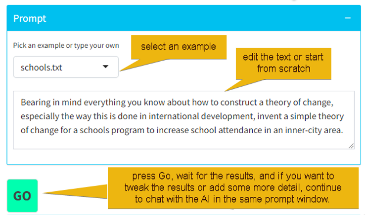
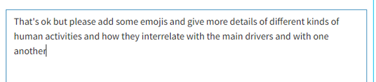
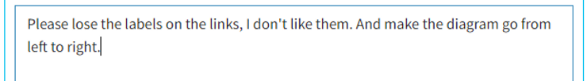
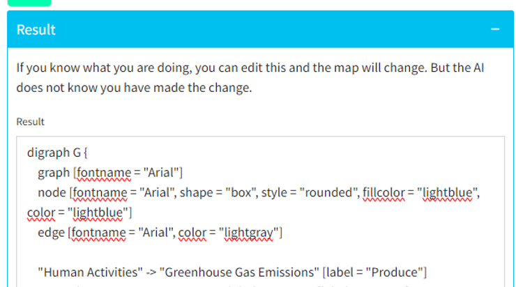

# theorymaker3

To install - clone the repo - provide a config.yml file in the root with your credentials - at least with your api key.

If you want to record use of the API in the Account tab, you'll need a SQL database. If you want to use Polished authentication, you will need to provide your Polished credentials. Otherwise you will need to comment out those parts of the code.

```         
default:
  api_key: "your openAI api key"
  sql_cm:
    dbname: ""
    host: ""
    port: 
    username: ""
    password: ""
  polished_api_key: "xx"
  firebase_apiKey: "xx"
  firebase_authDomain: "xx"
  firebase_projectId: "xx"
```

Then just run `shiny::runApp()`.

## About theorymaker

We just built a toy web app called [theorymaker3](https://causalmap.shinyapps.io/theorymaker3/) - a very experimental service provided for free by us. Chat with an AI to build a graphical theory of change.

The app contains a few example prompts to get started, which you can edit, or you can start with your own.

It's a proof of concept and to start a conversation.

At the moment **you cannot save your work**, so be sure to take screenshots of your diagrams and/or download them using the `Save SVG` button.

If you want to recreate the same diagrams at a later time, you will have to copy and paste the prompts you used and keep them somewhere safe.

You can export your diagram in SVG format, a lossless vector format which you can paste into most modern word processing and graphics programs including PowerPoint. However the export isn't that easy to work with, it doesn't resolve to the sort of connectors and boxes you might be used to manipulating in PowerPoint.

**Do NOT use theorymaker for any information which is sensitive** or which identifies individuals.

This app uses the GPT 4 API which is **quite expensive for us**, so feel free to mess around for quarter of an hour or so but let us know if you want to use it for a bigger project.

## How to make a diagram



When you are happy with your first prompt, press Go and wait while the AI draws your diagram.

You can continue to build up or correct your diagram like this by typing into the chat window.



You can also tweak the formatting etc.



You may find it better to first create just one part of your diagram and then add more parts in later steps. You could build up quite detailed diagrams like this - but as you can't yet save your work, you might not want to bother at this point.

### Tweaking the results by hand

If you happen to know Graphviz syntax, you can edit the text in the result window to adjust your diagram directly. But the AI does not (yet) know what you have done so if you continue the chat, these changes will be lost.



## Theorymaker?

Steve says: I built a site called [theorymaker.info](http://theorymaker.info/) about ten years ago as a hobby project. It was my very first web app and I've since lost access to the code 😳. It's a bit flaky but people have been using it for all kinds of different projects around the world. You have to use a special syntax which is designed for the kind of text-heavy theories of change which are common in the kind of projects I was mostly involved in. Theorymaker 3 is a reimagining of the original Theorymaker.
